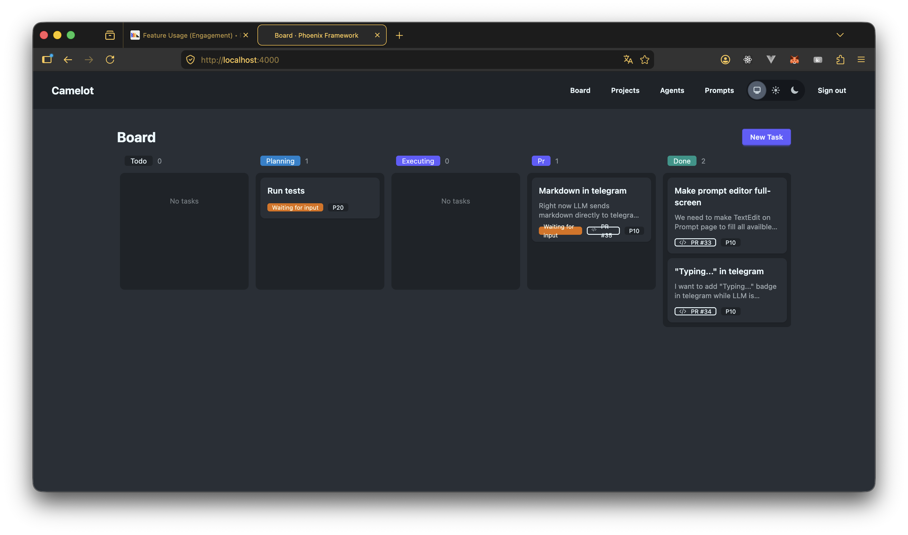

# Camelot

> Delegate coding tasks to AI agents. Manage them from a kanban board.

<p align="center">
  <a href="https://camelotai.tech?utm_source=github&utm_medium=readme&utm_campaign=hero">
    
  </a>
  
  
  
  
  
</p>

Camelot gives development teams a way to safely scale their engineering output
with AI — without giving up control. Create tasks on a board, let AI agents plan
and implement them, review and approve before anything ships. Like having junior
developers who never sleep, managed through a clean visual interface.

<p align="center">
  
</p>

## How It Works

1. **Create tasks** on a kanban board — or sync them from GitHub Issues
2. **AI agents pick up tasks**, write a plan, and wait for your approval
3. **You approve the plan** — agents execute it and open a PR
4. **Watch it happen** in real-time with live session streaming
5. **Review the PR**, merge, done — agents handle reviewer comments and CI failures too

## Features

- **Kanban board** — 6-stage workflow: todo, planning, executing, pr, done, cancelled. Set priorities, track state at a glance.
- **Multi-agent coordination** — Run Claude Code and Codex agents in parallel across projects. Priority-based task dispatch.
- **Human-in-the-loop** — Agents propose plans before writing code. You approve before anything ships. No surprise commits.
- **GitHub-native** — Sync issues as tasks, track PRs, monitor CI checks. Tasks auto-complete when PRs merge.
- **Customizable prompts** — Per-project prompt templates with `{{variable}}` interpolation. Tune agent behavior to match your conventions.
- **Tool permissions** — Whitelist which CLI tools agents can use. Full control over agent capabilities.
- **Real-time streaming** — Watch agent output live via WebSocket. Full session logs for every execution.
- **Self-hosted** — Your code never leaves your infrastructure. PostgreSQL on your servers. No SaaS dependency.
- **Magic link auth** — No passwords to manage. Email-based authentication out of the box.

## Tech Stack

| Component | Technology |
|-----------|-----------|
| Backend | Elixir, Phoenix LiveView 1.1 |
| Data layer | Ash Framework 3.0 |
| Database | PostgreSQL (via Ecto + AshPostgres) |
| Background jobs | Oban |
| Real-time | Phoenix PubSub + WebSocket |
| Frontend | Phoenix LiveView + Tailwind CSS v4 |
| Auth | AshAuthentication (magic link) |
| HTTP client | Req |

## Getting Started

### Prerequisites

- Elixir >= 1.15 and Erlang/OTP (use [asdf](https://asdf-vm.com/) or [mise](https://mise.jdx.dev/) for version management)
- PostgreSQL >= 14
- A GitHub personal access token (for GitHub integration)
- [Claude Code](https://docs.anthropic.com/en/docs/claude-code) and/or [Codex](https://github.com/openai/codex) CLI installed

### Installation

```bash
# Clone the repo
git clone https://github.com/T0ha/camelot.git
cd camelot

# Install dependencies, create DB, run migrations, build assets
mix setup

# Generate a secret key
mix phx.gen.secret
# Set it as SECRET_KEY_BASE in your environment

# Start the server
iex -S mix phx.server
```

Visit [`localhost:4000`](http://localhost:4000).

### First Steps

1. Sign in with a magic link sent to your email
2. Create a project pointing to a local git repository
3. Add an agent (Claude Code or Codex)
4. Create a task and watch it flow through the board

See [`docs/get-started.md`](docs/get-started.md) for a full walkthrough
from first login to your first merged PR.

## Configuration

Key environment variables (see `config/runtime.exs` for full details):

| Variable | Description | Required |
|----------|-------------|----------|
| `DATABASE_URL` | PostgreSQL connection string | Production (optional override in dev/test) |
| `SECRET_KEY_BASE` | Cookie signing secret (`mix phx.gen.secret`) | Production |
| `PHX_HOST` | Application hostname | Production |
| `PORT` | HTTP port (default: 4000) | No |
| `POOL_SIZE` | Database pool size (default: 10) | No |
| `REGISTRATION_ENABLED` | When `false`, new sign-ups are blocked; existing users can still sign in (default: `true`) | No |

### Bootstrapping users

When `REGISTRATION_ENABLED=false` (cloud beta mode), the sign-in screen rejects unknown emails. Use the mix task to add users — the first invocation creates an admin who can then add more users from `/admin/users`:

```sh
# First admin (bootstrap)
mix camelot.create_user me@example.com

# Subsequent users
mix camelot.create_user teammate@example.com --role user
```

Inside a release:

```sh
bin/camelot eval 'Mix.Tasks.Camelot.CreateUser.run(["me@example.com"])'
```

## Architecture

```
Projects ──→ Agents ──→ Sessions
    │            │
    └── Tasks ───┘
         │
    PromptTemplates
```

- **Projects** map to local git repositories with optional GitHub integration
- **Agents** wrap a CLI tool (Claude Code or Codex), managed as OTP GenServer processes
- **Tasks** flow through a state machine: draft → todo → planning → executing → pr → done
- **Sessions** record each agent execution with full output logs
- **Prompt Templates** are customizable per-project with variable interpolation

Key modules: `Camelot.Board.Task`, `Camelot.Agents.Agent`,
`Camelot.Runtime.AgentProcess`, `Camelot.Projects.Project`,
`Camelot.Prompts.PromptTemplate`

## Development

```bash
mix test              # Run tests
mix format            # Format code
mix credo             # Lint
mix dialyzer          # Type checking
mix precommit         # All checks before committing
```

See `CLAUDE.md` and `AGENTS.md` for AI-assisted development guidelines.

## Deployment

Camelot is a standard Phoenix application. See the
[Phoenix deployment guides](https://hexdocs.pm/phoenix/deployment.html)
for general instructions.

Docker and docker-compose configurations are planned for a future release.

## Roadmap

- [x] Kanban board with full task lifecycle
- [x] Claude Code and Codex agent support
- [x] GitHub issue sync and PR tracking
- [x] Prompt template customization
- [x] Real-time session streaming
- [x] Tool permission controls
- [ ] Docker / docker-compose deployment
- [ ] Webhook-based GitHub integration
- [ ] Additional agent types
- [ ] Team / multi-user collaboration
- [ ] Camelot Cloud (hosted version)

## Contributing

PRs welcome — see the roadmap above for ideas.

- Follow the [Elixir Style Guide](https://github.com/christopheradams/elixir_style_guide)
- Run `mix precommit` before submitting
- Open an issue first for large changes

## License

[GPL-2.0](LICENSE)

---

<p align="center">
  <a href="https://camelotai.tech?utm_source=github&utm_medium=readme&utm_campaign=footer">camelotai.tech</a>
</p>
